# SMITE - MEMORY CARD & QUIZ GAMES
(DEVELOPER: LEWIS HAZELWOOD)

[Live Webpage](https://lewishaz.github.io/CI_PP2_SMITE/)

## Introduction
Hello and welcome to the Read Me documentation for my PP2 project, named: Memory Card and Quiz games based on the video game SMITE (one of my favourite of all time).
This project includes two seperate games for the user to enjoy, spanning over two webpgaes. The theme of the project is solely based around the aforementioned video game
of SMITE, a project made by a company called Hi-Rez Studios who are based in Alpharetta, Georgia in the USA. Many of the games features, typography and imagery have been
crafted with the elements seen from SMITE in mind. 

## User manual
The website has been created to work on any device: mobiles, tablets, desktops & macbooks. Each device will have its own different viewing experiences in order to make sure the content can be viewed and accessed to its full capacity. There is no complicated controls for each of the games and the user is only required to be able to click on certain section of the screen at the point of the game loading in.

## Table of Contents

1. [Project Goals](#project-goals)
    1. [User Goals](#user-goals)
    2. [Site Owner Goals](#site-owner-goals)
2. [User Experience](#user-experience)
    1. [Target Audience](#target-audience)
    2. [User Requirements and Expectations](#user-requirements-and-expectations)
    3. [User Stories](#user-stories)
3. [Design](#design)
    1. [Design Choices](#design-choices)
    2. [Colour](#colour)
    3. [Fonts](#fonts)
    4. [Structure](#structure)
    5. [Wireframes](#wireframes)
4. [Technologies Used](#technologies-used)
    1. [Languages](#languages)
    2. [Frameworks & Tools](#frameworks-and-tools)
5. [Features](#features)
6. [Testing](#validation)
    1. [HTML Validation](#HTML-validation)
    2. [CSS Validation](#CSS-validation)
    3. [Accessibility](#accessibility)
    4. [Performance](#performance)
    5. [Device testing](#testing-on-different-devices)
    6. [Browsers](#browsers)
    7. [Testing user stories](#testing-user-stories)
7. [Bugs](#bugs)
8. [Deployment](#deployment)
9. [Credits](#credits)
10. [Thanks to](#thanks-to)

## Project Goals

The goal of the project was to create a fun, recognisable and interactive set of games that are easy to pick up and play whilst also introducing users to the game that is SMITE and also the theme of mythology.

### User Goals

- Play game(s) that have a simple rule-set and are easy to pick up yet hard to master
- Give themselves a challenge by replaying the games to get the highest scores

### Site Owner Goals

- Create a game that is engaging enough to keep the player playing the games
- Create a game that is good to look at design wise
- Create a game that has simple and inituitive navigation
- Create fully accessible and responsive pages

## User Experience

### Target Audience

- Anyone who is interested in playing a game of memory with cards or a quiz game
- Anyone with an interest in the game 'SMITE' OR an interest Mythology
- Someone who is looking to pass time with a quick and thought provoking game(s)

### User Requirements and Expectations

- Easy and simple to understand game rules
- A resposive website that can be played anywhere/anyhow
- Gameplay features working as expected
- Content is easily readable
- Ease of navigation throughout the website and gameplay
- A feedback form to give the developer feedback

## User Stories

### Site User
1. As a site user, I want to play a game that is fun and makes me want to keep playing.
2. As a site user, I want to play multiple games for a sense of variety.
3. As a site user, I want to know when I have completed a game.
4. As a site user, I want to be able to play the game on any device.
5. As a site user, I want to know what score I have during and after finishing each game.
6. As a site user, I want to see what the correct answer to question was if I got it wrong.
7. As a site user, I want to leave feedback for the game's developer.
8. As a site user, I want to know what game I am playing.

## Site Owner
9. As a site owner, I want the user to understand how to play each game without the need for instructions.
10. As a site owner, I want the user to feel challenged but enjoy both games.
11. As a site owner, I want my games to be fully reponsive.
12. As a site owner, I want the user to be able to give me feedback on how they found the game.
13. As a site owner, I want the user to be able to return the game if they hit a 404 page with a back to game button.
14. As a site owner, I want the user to be able to access the game from anywhere/any device.
15. As a site owner, I want the navigation of the webpages to be simple for the user.
16. As a site owner, I want the user to be able to access my social links to give further feedback or to connect.

## Design

### Design Choice
- The design choice for the website is based on the game 'SMITE', with the colour and visual elements for the site being similar to that of what can be seen the actual video game itself.

### Colour Scheme
- To expand on the colour of the website, it has been kept consistent across all pages and is mainly inspired by the logo of the game itself. This being a black, slate grey and yellow palette, black being used for the background elements whilst the slate grey and yellow are used for all the page elements such as boxes and text.
- The idea behind the colour palette was to have the user be able to see all the relevant information on the screen easily whilst also potentially seeing that it matches the game's logo colour palette too.

### Fonts
Google Fonts has been implemented on the website, Tilt Prism has been used for the main elements of the site with San Serif being used as the fallback font. The font Tilt Prism has been used to match my game's theme which is Mythology and Gods/Goddesses. Other fonts have been used such as Times New Roman to bring extra attention to the sections where it has been used, this font's name is also the name of a Pantheon so I found it fitting.

### Structure
- A game screen for each game, which can be accessed through the navbar. 
- A page for feedback, which includes a inputs for their name/email/message for the developer. It can also be accessed with the navbar.
- A modal for when the user completes the matching card game, this shows them their stats and results for the game and also an option to start the game again.
- A screen popup for when the user gets a question correct or incorrect, immediate feedback for them to know the result and to start the next question after 5 seconds.
- An end of game result for the quiz with an option with a button to restart the quiz and try again.
- A 404 page which can only be accessed by incorrectly typing a non-existent website link into the address bar.

### Wireframes

Desktop size

Tablet Size

Mobile Size

## Technologies Used

### Languages
1. HTML
2. CSS
3. JavaScript

### Frameworks & Tools
- EmailJS
- Git
- GitHub
- Gitpod
- Paint
- Balsamiq
- Google Fonts
- Font Awesome
- Favicon
- Firefox Dev Tools
- W3C Validator
- Jigsaw W3C Validator
- JSHint
- Wave Validator
- Lighthouse

## Features
The website has 4 pages and 25 features.

### Nav bar
- A navbar that has simple shapes and displays text for each page the user can access.
- User stories covered: 15

See feature

### Card game page Title
- Title shown at the top of the page in a big and readble font.
- User stories covered: 8, 9

See feature

### Card game page Logo
- Logo to show the game that the card game is based upon.

See feature

### Card game score/lives
- An area to show how much score/lives the player has left during gameplay.
- User stories covered: 5

See feature

### Card game turns
- An area to show how many turns the player has used during gameplay.
- User stories covered: 5, 9, 10

See feature

### Card game timer
- An area to show how much time has passed since the game began.
- User stories covered: 10

See feature

### Card game - Play area
- An area that is the game board filled with the 16 cards that the user must pair up to complete the game.
- User stories covered: 1, 4, 6, 9, 10, 14

See feature

### Footer
- A footer that displays credits within a link to the company's website who makes SMITE, developer name and also links to socials.
- User stories covered: 16

See feature

### Quiz title
- A title that displays at the top of the page to let the user know what game they are playing.
- User stories covered: 8, 9

See feature

### Quiz question
- A line of text that asks the user a question based on the category shown below (in my game's case it is only Mythology included to match the theme).
- User stories covered: 1, 2, 8

See feature

### Quiz category
- A small box with text inside to indicate to the user what category the quiz is.

See feature

### Quiz question options
- The options to choose from for the answer, all shown in yellow rectangles to the user.
- User stories covered: 1, 10

See feature

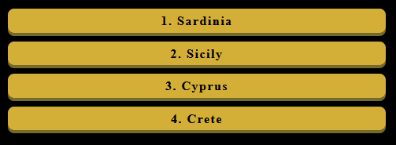

### Quiz reveal button
- The button for the user to lock in their answer and have immediate feedback as to whether or not they were correct.
- User stories covered: 2, 6

See feature

### Quiz answer reveal - correct
- Reveals that the question was answered correctly to the user and displays a tick and some text to them with the interactive feedback.
- User stories covered: 6

See feature

### Quiz answer reveal - incorrect
- Reveals that the question was not answered correctly to the user and displays a cross and some text to them with the interactive feedback.
- User stories covered: 6, 10

See feature

### Quiz answer reveal - show correct answer
- Reveals the answer to the question if it was not answered correctly by the user.
- User stories covered: 1

See feature

### Quiz answer reveal - please select an option
- A piece of feedback that lets the user know they have not selected an option and need to choose to progress.
- User stories covered: 11

See feature

### Quiz overall score counter
- A counter up to 10 that lets the user both know how many questions are remaining and what their score is so far.
- User stories covered: 2, 10

See feature

### Quiz end of game score
- A score which is displayed once the final question has been answered and the logic has calculated the score the user got.
- User stories covered: 3, 5

See feature

### Quiz - play again button
- A button that is displayed below the score when the game has complete, the user can click this to restart the quiz.
- User stories covered: 1, 11, 15

See feature

### Form title
- A title that is displayed at the top of the form page to ask the user if they have any feedback to give.

See feature

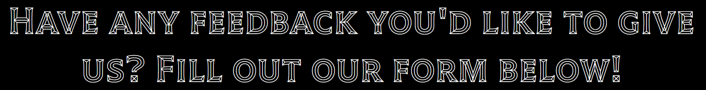

### Form to fill out
- Section where the user can input their name, email and message/feedback to the developer about what they thought of the games. This email is then sent to my personal email through the emailJS API.
- User stories covered: 7, 12

See feature

### Form - form submitted thank you image
- An image that pops up when the user has posted their feedback.

See features

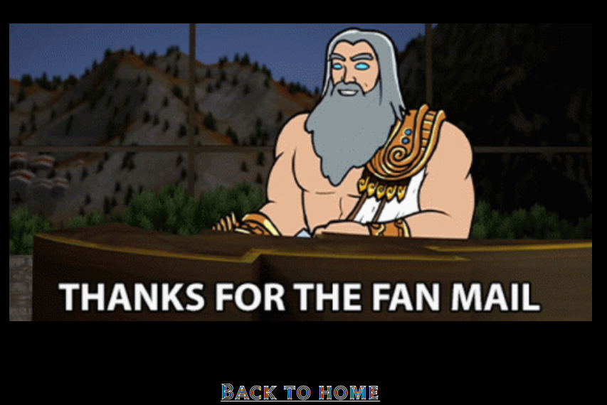

### Form - thank you message
- A thank you message to the user for playing the games.

### 404 page
- A page that displays when the user puts an incorrect link into the address bar.
- User stories covered: 13

See features

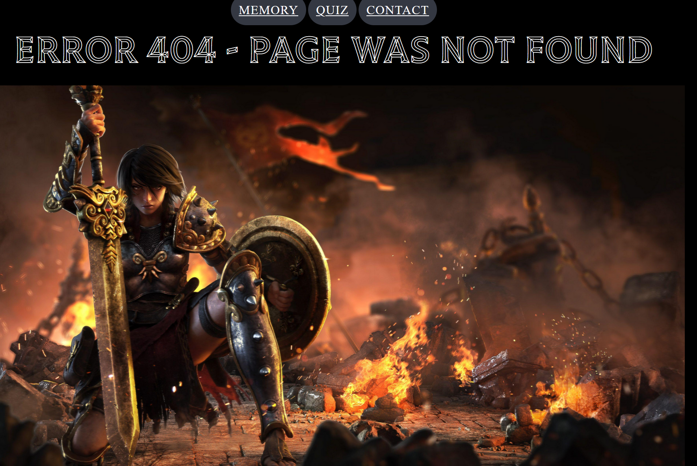

### 404 return to game button
- A button that allows the user to return the card game page.
- User stories covered: 15

See features

## Validation

### HTML Validation
The W3C Markup Validation Service was used to validate the HTML code for the webiste. All pages have passed the checks and have no errors - this can be checked at any time.
- index.html [results](https://validator.w3.org/nu/?doc=https%3A%2F%2Flewishaz.github.io%2FCI_PP2_SMITE%2Findex.html) - No Errors Found.
- quiz.html [results](https://validator.w3.org/nu/?doc=https%3A%2F%2Flewishaz.github.io%2FCI_PP2_SMITE%2Fquiz.html) - No Errors Found.
- form.html [results](https://validator.w3.org/nu/?doc=https%3A%2F%2Flewishaz.github.io%2FCI_PP2_SMITE%2Fform.html) - No Errors Found.
- 404.html [results](https://validator.w3.org/nu/?doc=https%3A%2F%2Flewishaz.github.io%2FCI_PP2_SMITE%2F404.html) - No Errors Found.
### CSS Validation
The W3C Jigsaw CSS Validation Service was used to validate the CSS code for the website.
- site [results](https://jigsaw.w3.org/css-validator/validator?uri=https%3A%2F%2Flewishaz.github.io%2FCI_PP2_SMITE%2F&profile=css3svg&usermedium=all&warning=1&vextwarning=&lang=en) - No Errors Found.

### Accessibility
The WAVE WebAIM web accessibility evaluation tool was used to make sure the website ticked all accessiblity boxes.
- index.html [results](https://wave.webaim.org/report#/https://lewishaz.github.io/CI_PP2_SMITE/index.html) - Alerts were found but this is due to the hidden elements of the card game. No issues.
- quiz.html [results](https://wave.webaim.org/report#/https://lewishaz.github.io/CI_PP2_SMITE/quiz.html) - No issues.
- form.html [results](https://wave.webaim.org/report#/https://lewishaz.github.io/CI_PP2_SMITE/form.html) - No issues.
- 404.html [results](https://wave.webaim.org/report#/https://lewishaz.github.io/CI_PP2_SMITE/404.html) - No issues.

### Performance 
Google Lighthouse within the Google Chrome Developer Tools was used to test the overall performance of the website.

 Memory Card Game 

 Quiz Game 

 Contact Form 

 404 error page 

### JSHint
JSHint was used to verify the validity of the JavaScript used in my website. There were no significants errors found.

 cardgame.js 

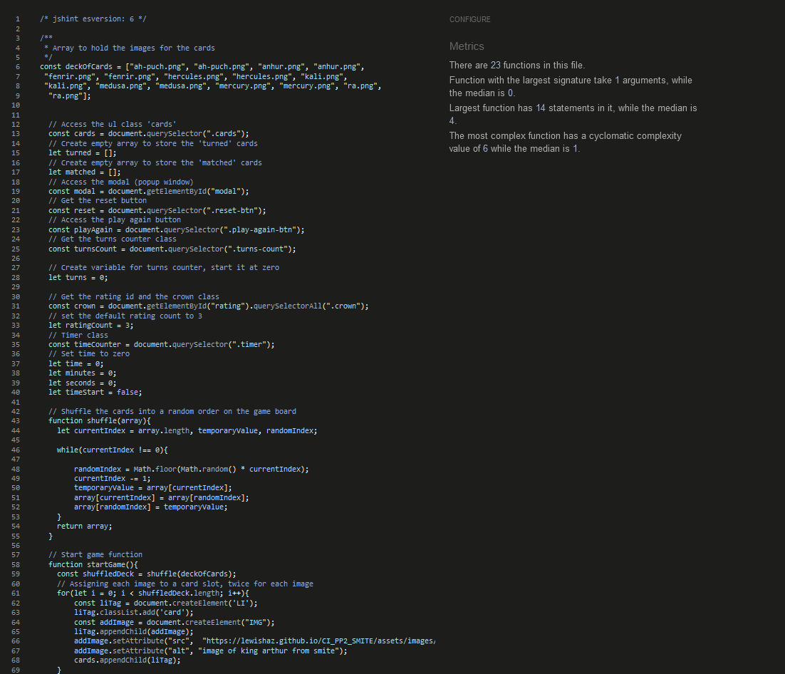

 quiz.js 

 Due to the contact feedback form being sent by an external library I was unable to fix the unused/undefined variables for the email.js file.

 email.js 

### Testing on different devices
The website and all pages have been tested on many devices, including:
- iPhone 10
- iPad
- Galaxy S22

### Browsers
The website has also been tested on various browsers, including:
- Google Chrome
- Mozilla Firefox
- Microsoft Edge

### Testing User stories
1. As a site user, I want to play a game that is fun and makes me want to keep playing.

| **Feature** | **Action** | **Expected Result** | **Actual Result** |
|-------------|------------|---------------------|-------------------|
| Memory Card game | Start matching the pairs of cards | Gameplay starts | Works as expected |
| Quiz game | View the question and start answering by clicking one of the options | Gameplay starts and shows answer | Works as expected |

Evidence of

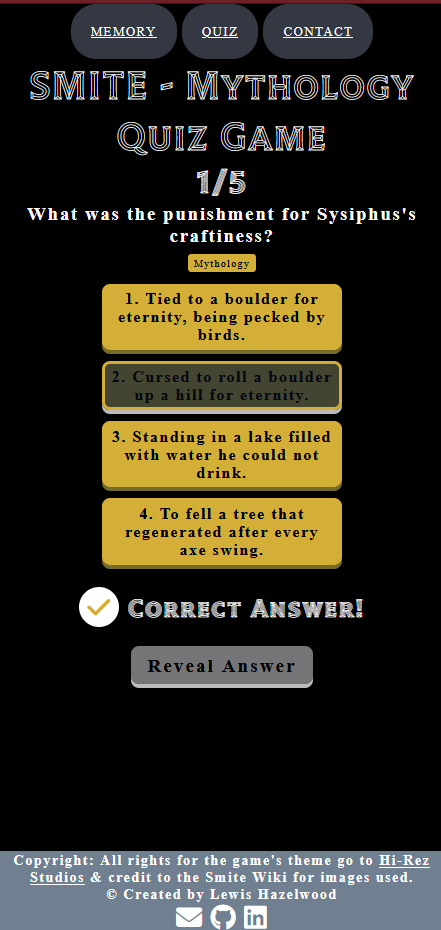

2. As a site user, I want to play multiple games for a sense of variety.

| **Feature** | **Action** | **Expected Result** | **Actual Result** |
|-------------|------------|---------------------|-------------------|
| Memory Card game | Start matching the pairs of cards | Gameplay starts | Works as expected |
| Quiz game | View the question and start answering by clicking one of the options | Gameplay starts and shows answer | Works as expected |

Evidence of

3. As a site user, I want to know when I have completed a game.

| **Feature** | **Action** | **Expected Result** | **Actual Result** |
|-------------|------------|---------------------|-------------------|
| Memory Card game modal | Finish matching all cards to be shown a popup with game complete on it | Modal pops up after all cards are paired showing stats and score | Works as expected |
| Quiz game score result | View the question and start answering by clicking one of the options | Gameplay starts and shows answer | Works as expected |

Evidence of

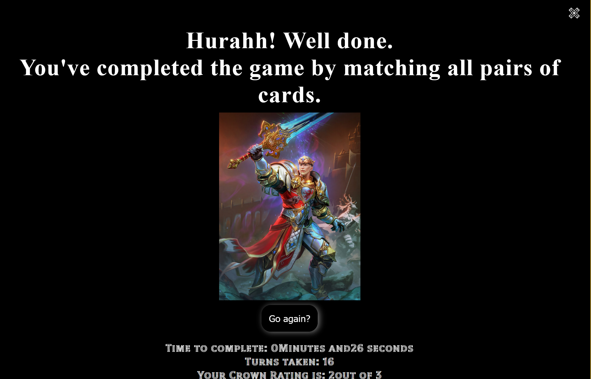
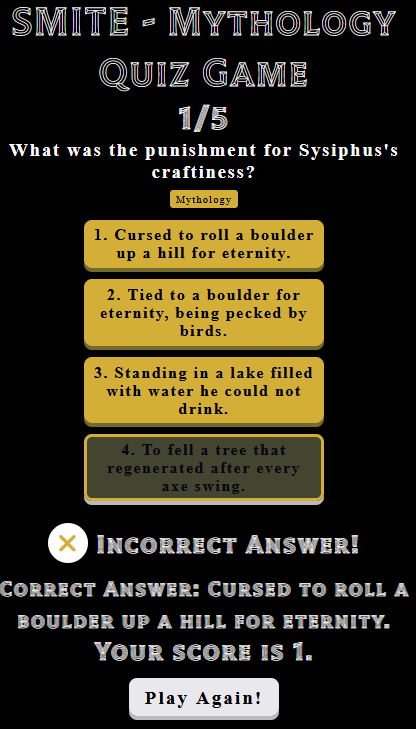

4. As a site user, I want to be able to play the game on any device.

| **Feature** | **Action** | **Expected Result** | **Actual Result** |
|-------------|------------|---------------------|-------------------|
| Memory Card game any size | Memory card game can be played on any device | No errors or overflowing containers | Works as expected |
| Quiz game any size | Quiz game any size | No errors or overflowing containers | Works as expected |

Evidence of

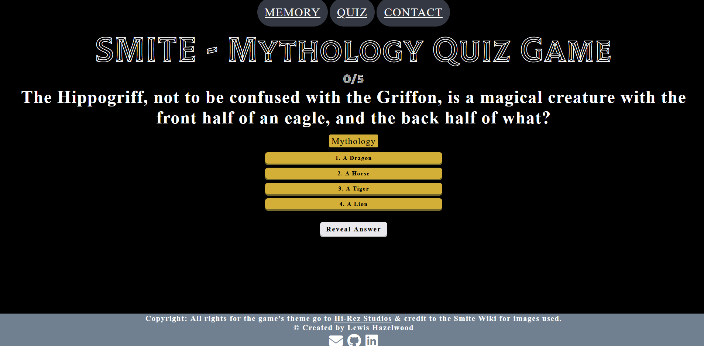

5. As a site user, I want to know what score I have during and after finishing each game.

| **Feature** | **Action** | **Expected Result** | **Actual Result** |
|-------------|------------|---------------------|-------------------|
| Memory Card game score | Memory card game displays the crown rating during gameplay | Icons can be seen and disappear if the user takes too many turns | Works as expected |
| Quiz game score | Quiz game score counts up as user gets questions correct | Score counter is going up | Works as expected |
| Memory Card game end game score | Memory card game displays a modal popup to show the overall score at the end | Score can be seen by player in terms of turns taken and overall rating | Works as expected |
| Quiz game end game score | Quiz game score shows total score at the end of the quiz | Pops up below the final answered question | Works as expected |

Evidence of

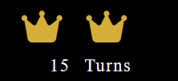
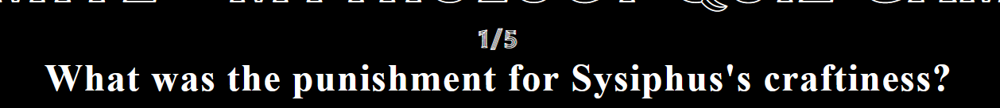
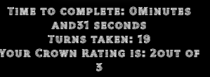

6. As a site user, I want to see what the correct answer to question was if I got it wrong.

| **Feature** | **Action** | **Expected Result** | **Actual Result** |
|-------------|------------|---------------------|-------------------|
| Quiz game reveal answer | User answer a question using the options provided | Game logic tells them if they are correct and displays to the screen | Works as expected |

Evidence of

7. As a site user, I want to leave feedback for the game's developer.

| **Feature** | **Action** | **Expected Result** | **Actual Result** |
|-------------|------------|---------------------|-------------------|
| Feedback form page | Navigate to form page and fill in form to submit | Submit has been hit and sends an email through emailJS to the developer | Works as expected |

Evidence of

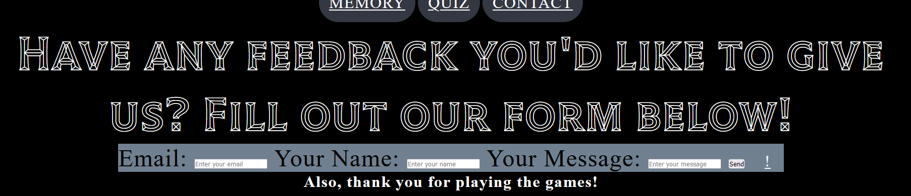

8. As a site user, I want to know what game I am playing.

| **Feature** | **Action** | **Expected Result** | **Actual Result** |
|-------------|------------|---------------------|-------------------|
| Memory card game title | Navigate to memory card game page | User can see the title at the top of the page | Works as expected |
| Quiz game title | Navigate to quiz game page | User can see the title at the top of the page | Works as expected |

Evidence of

9. As a site owner, I want the user to understand how to play each game without the need for instructions.

| **Feature** | **Action** | **Expected Result** | **Actual Result** |
|-------------|------------|---------------------|-------------------|
| Memory card game score and time area | Navigate to memory card game page | User can see the game score and time area | Works as expected |
| Quiz game title | Navigate to quiz game page | User can see the question area | Works as expected |

Evidence of

10. As a site owner, I want the user to feel challenged but enjoy both games.

| **Feature** | **Action** | **Expected Result** | **Actual Result** |
|-------------|------------|---------------------|-------------------|
| Memory card game scores | User gets a low score and tries to do better next time  | Plays again and improves their score | Works as expected |
| Quiz game scores| User gets a question wrong and feels motivated to next one correct | User gets the next one correct and feels good | Works as expected |

Evidence of

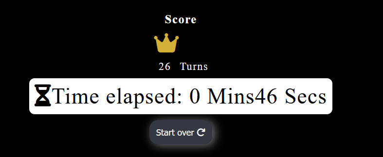
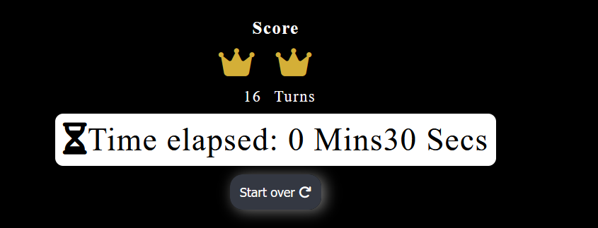

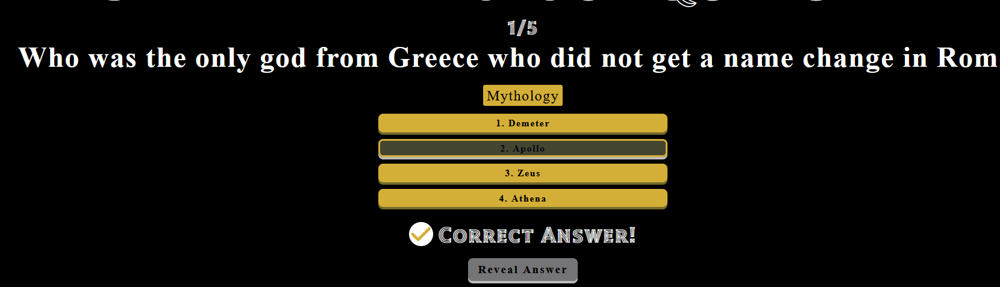

11. As a site owner, I want my games to be fully reponsive.

| **Feature** | **Action** | **Expected Result** | **Actual Result** |
|-------------|------------|---------------------|-------------------|
| Memory card game buttons | User can start over at any time and also close the modal | Restarts when user clicks start over and modal closes correctly after onclick | Works as expected |
| Quiz game highlight option | User click on an option | User can see which option they have chosen after clicking on it | Works as expected |

Evidence of

12. As a site owner, I want the user to be able to give me feedback on how they found the game.

| **Feature** | **Action** | **Expected Result** | **Actual Result** |
|-------------|------------|---------------------|-------------------|
| Feedback form page | Navigate to form page and fill in form to submit | Submit has been hit and sends an email through emailJS to the developer | Works as expected |

Evidence of

13. As a site owner, I want the user to be able to return the game if they hit a 404 page with a back to game button.

| **Feature** | **Action** | **Expected Result** | **Actual Result** |
|-------------|------------|---------------------|-------------------|
| 404 Page back to home button | User somehow navigate to 404 error page with incorrect address, they can navigate back to home with a button at bottom the page | User returned to home page | Works as expected |

Evidence of

14. As a site owner, I want the user to be able to access the game from anywhere/any device.

| **Feature** | **Action** | **Expected Result** | **Actual Result** |
|-------------|------------|---------------------|-------------------|
| Any device resposniveness | User can use any device connected to the internet and access the site | Site can be accessed | Works as expected |

Evidence of

15. As a site owner, I want the navigation of the webpages to be simple for the user.

| **Feature** | **Action** | **Expected Result** | **Actual Result** |
|-------------|------------|---------------------|-------------------|
| Nav bar | User can access any part of the site easily with the nav bar options | Each page can be accessed | Works as expected |

Evidence of

16. As a site owner, I want the user to be able to access my social links to give further feedback or to connect.

| **Feature** | **Action** | **Expected Result** | **Actual Result** |
|-------------|------------|---------------------|-------------------|
| Footer media links | User can access three different links at the bottom to media pages such as GitHub, Linkedin and Feedback form | Each page can be accessed | Works as expected |

Evidence of

## Bugs
| **Bug** | **Fix** |
| ----------- | ----------- |
| Images not appearing on deployed sites | Link images correctly using full deployed website file paths |
| Social link icons not appearing on form page | Put link to fontawesome script into form html page |
| Modal image overflowing into the main page | Adjust the padding values within CSS |
| No data being sent to email through emailJS API | Adjust the email template to have content to be sent |
| Mobile responsiveness on card game play area not correct | Added a media query to reduce the size of the game area depending on the device screen size |

## Deployment

### GitHub Pages
The website was deployed using GitHub Pages by following these steps:
1. In the GitHub repository navigate to the Settings tab
2. On the left hand menu select Pages
3. For the source select Branch: main
4. Once saved, GitHub will refresh and your website will be publishd from GitHub repository
5. The link to your published website will appear: "Your site is published at https://lewishaz.github.io/CI_PP2_SMITE/"

### Forking the GitHub Repository
1. Go to the GitHub repository
2. Click on Fork button in top right corner

### Making a Local Clone
1. Go to the GitHub repository 
2. Locate the Code button above the list of files and click it
3. Highlight the "HTTPS" button to clone with HTTPS and copy the link
4. Open Git Bash
5. Change the current working directory to the one where you want the cloned directory
6. Type git clone and paste the URL from the clipboard ($ git clone https://github.com/YOUR-USERNAME/YOUR-REPOSITORY)
7. Press Enter to create your local clone

## Credits

### Images
- God card images were taken from [Smite wiki](pt-br.smite.wikia.com/)
- Smite edition logo taken from [Smite Game](smitegame.com)
- Smite favicon picture taken from [Malfacio](malfacio.deviantart.com)
- Smite thank you image taken from [Getsukeii](getsukeii.deviantart.com)

### Code
- Modal for card game made with help from [W3Schools](https://www.w3schools.com/w3css/w3css_modal.asp)
- EmailJS API used for form submission [EmailJS](https://www.emailjs.com/)
- Code from CI student Aleksandra and her wonderful project [Aleksandracodes](https://github.com/aleksandracodes/CI_PP2_SunshineGuessing)
- Code with Voran for help setting up emailJS [Code with Voran](https://www.youtube.com/watch?v=x7Ewtay0Q78)
- Open Trivia DB API for quiz questions [Open Trivia DB](https://opentdb.com/api_config.php)

## Acknowledgements
Many thanks to all those around me for the support,  including:
- Family, friends and my wonderful fiancee.
- Mo Shami my tutor for the guidance.

