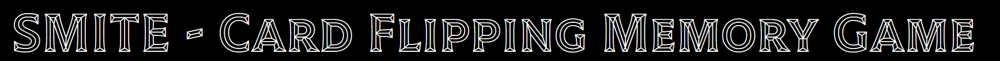
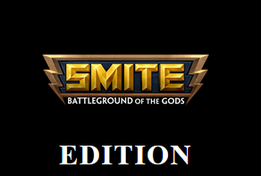

# SMITE - MEMORY CARD & QUIZ GAMES
(DEVELOPER: LEWIS HAZELWOOD)

[Live Webpage](https://lewishaz.github.io/CI_PP2_SMITE/)

## Introduction
Hello and welcome to the Read Me documentation for my PP2 project, named: Memory Card and Quiz games based on the video game SMITE (one of my favourite of all time).
This project includes two seperate games for the user to enjoy, spanning over two webpgaes. The theme of the project is solely based around the aforementioned video game
of SMITE, a project made by a company called Hi-Rez Studios who are based in Alpharetta, Georgia in the USA. Many of the games features, typography and imagery have been
crafted with the elements seen from SMITE in mind. 

## User manual
The website has been created to work on any device: mobiles, tablets, desktops & macbooks. Each device will have its own different viewing experiences in order to make sure the content can be viewed and accessed to its full capacity. There is no complicated controls for each of the games and the user is only required to be able to click on certain section of the screen at the point of the game loading in.

## Table of Contents

1. [Project Goals](#project-goals)
    1. [User Goals](#user-goals)
    2. [Site Owner Goals](#site-owner-goals)
2. [User Experience](#user-experience)
    1. [Target Audience](#target-audience)
    2. [User Requirements and Expectations](#user-requirements-and-expectations)
    3. [User Stories](#user-stories)
3. [Design](#design)
    1. [Design Choices](#design-choices)
    2. [Colour](#colour)
    3. [Fonts](#fonts)
    4. [Structure](#structure)
    5. [Wireframes](#wireframes)
4. [Technologies Used](#technologies-used)
    1. [Languages](#languages)
    2. [Frameworks & Tools](#frameworks-and-tools)
5. [Features](#features)
6. [Testing](#validation)
    1. [HTML Validation](#HTML-validation)
    2. [CSS Validation](#CSS-validation)
    3. [Accessibility](#accessibility)
    4. [Performance](#performance)
    5. [Device testing](#testing-on-different-devices)
    6. [Browsers](#browsers)
    7. [Testing user stories](#testing-user-stories)
7. [Bugs](#bugs)
8. [Deployment](#deployment)
9. [Credits](#credits)
10. [Thanks to](#thanks-to)

## Project Goals

The goal of the project was to create a fun, recognisable and interactive set of games that are easy to pick up and play whilst also introducing users to the game that is SMITE and also the theme of mythology.

### User Goals

- Play game(s) that have a simple rule-set and are easy to pick up yet hard to master
- Give themselves a challenge by replaying the games to get the highest scores

### Site Owner Goals

- Create a game that is engaging enough to keep the player playing the games
- Create a game that is good to look at design wise
- Create a game that has simple and inituitive navigation
- Create fully accessible and responsive pages

## User Experience

### Target Audience

- Anyone who is interested in playing a game of memory with cards or a quiz game
- Anyone with an interest in the game 'SMITE' OR an interest Mythology
- Someone who is looking to pass time with a quick and thought provoking game(s)

### User Requirements and Expectations

- Easy and simple to understand game rules
- A resposive website that can be played anywhere/anyhow
- Gameplay features working as expected
- Content is easily readable
- Ease of navigation throughout the website and gameplay
- A feedback form to give the developer feedback

## User Stories

### Site User
1. As a site user, I want to play a game that is fun and makes me want to keep playing.
2. As a site user, I want to play multiple games for a sense of variety.
3. As a site user, I want to know when I have completed a game.
4. As a site user, I want to be able to play the game on any device.
5. As a site user, I want to know what score I have during and after finishing each game.
6. As a site user, I want to see what the correct answer to question was if I got it wrong.
7. As a site user, I want to leave feedback for the game's developer.
8. As a site user, I want to know what game I am playing.

## Site Owner
9. As a site owner, I want the user to understand how to play each game without the need for instructions.
10. As a site owner, I want the user to feel challenged but enjoy both games.
11. As a site owner, I want my games to be fully reponsive.
12. As a site owner, I want the user to be able to give me feedback on how they found the game.
13. As a site owner, I want the user to be able to return the game if they hit a 404 page with a back to game button.
14. As a site owner, I want the user to be able to access the game from anywhere/any device.
15. As a site owner, I want the navigation of the webpages to be simple for the user.
16. As a site owner, I want the user to be able to access my social links to give further feedback or to connect.

## Design

### Design Choice
- The design choice for the website is based on the game 'SMITE', with the colour and visual elements for the site being similar to that of what can be seen the actual video game itself.

### Colour Scheme
- To expand on the colour of the website, it has been kept consistent across all pages and is mainly inspired by the logo of the game itself. This being a black and yellow palette, black being used for the background elements whilst yellow is used for all the page elements such as boxes and text.
- The idea behind the colour palette was to have the user be able to see all the relevant information on the screen easily whilst also potentially seeing that it matches the game's logo colour palette too.

### Fonts
Google Fonts has been implemented on the website, Tilt Prism has been used for the main elements of the site with San Serif being used as the fallback font. The font Tilt Prism has been used to match my game's theme which is Mythology and Gods/Goddesses. Other fonts have been used such as Times New Roman to bring extra attention to the sections where it has been used, this font's name is also the name of a Pantheon so I found it fitting.

### Structure
- A game screen for each game, which can be accessed through the navbar. 
- A page for feedback, which includes a inputs for their name/email/message for the developer. It can also be accessed with the navbar.
- A modal for when the user completes the matching card game, this shows them their stats and results for the game and also an option to start the game again.
- A screen popup for when the user gets a question correct or incorrect, immediate feedback for them to know the result and to start the next question after 5 seconds.
- An end of game result for the quiz with an option with a button to restart the quiz and try again.
- A 404 page which can only be accessed by incorrectly typing a non-existent website link into the address bar.

### Wireframes

Desktop size

Tablet Size

Mobile Size

## Technologies Used

### Languages
1. HTML
2. CSS
3. JavaScript

### Frameworks & Tools
- EmailJS
- Git
- GitHub
- Gitpod
- Paint
- Balsamiq
- Google Fonts
- Font Awesome
- Favicon
- Firefox Dev Tools
- W3C Validator
- Jigsaw W3C Validator
- JSHint
- Wave Validator
- Lighthouse

## Features
The website has ...

### Card game page Title
- Title shown at the top of the page in a big and readble font.
- User stories covered: 8, 9

See feature

### Card game page Logo
- Logo to show the game that the card game is based upon.

See feature

### Card game score/lives
- An area to show how much score/lives the player has left during gameplay.
- User stories covered: 5

See feature

### Card game turns
- An area to show how many turns the player has used during gameplay.
- User stories covered: 5, 9, 10

See feature

### Card game timer
- An area to show how much time has passed since the game began.
- User stories covered: 10

See feature

### Card game - Play area
- An area that is the game board filled with the 16 cards that the user must pair up to complete the game.
- User stories covered: 1, 4, 6, 9, 10, 14

See feature

### Footer
- A footer that displays credits within a link to the company's website who makes SMITE, developer name and also links to socials.
- User stories covered: 16

See feature

## Deployment

### GitHub Pages
The website was deployed using GitHub Pages by following these steps:
1. In the GitHub repository navigate to the Settings tab
2. On the left hand menu select Pages
3. For the source select Branch: main
4. Once saved, GitHub will refresh and your website will be publishd from GitHub repository
5. The link to your published website will appear: "Your site is published at https://aleksandracodes.github.io/CI_PP2_SMITE/"

### Forking the GitHub Repository
1. Go to the GitHub repository
2. Click on Fork button in top right corner

### Making a Local Clone
1. Go to the GitHub repository 
2. Locate the Code button above the list of files and click it
3. Highlight the "HTTPS" button to clone with HTTPS and copy the link
4. Open Git Bash
5. Change the current working directory to the one where you want the cloned directory
6. Type git clone and paste the URL from the clipboard ($ git clone https://github.com/YOUR-USERNAME/YOUR-REPOSITORY)
7. Press Enter to create your local clone

## Acknowledgements
Many thanks to all those around me for the support,  including:
- Family, friends and my wonderful fiancee.
- Mo Shami my tutor for the guidance.

